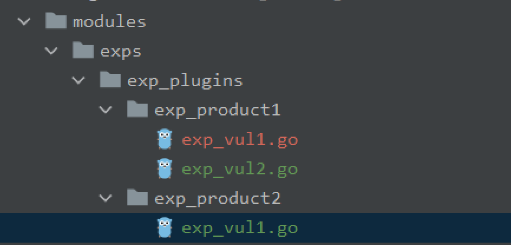
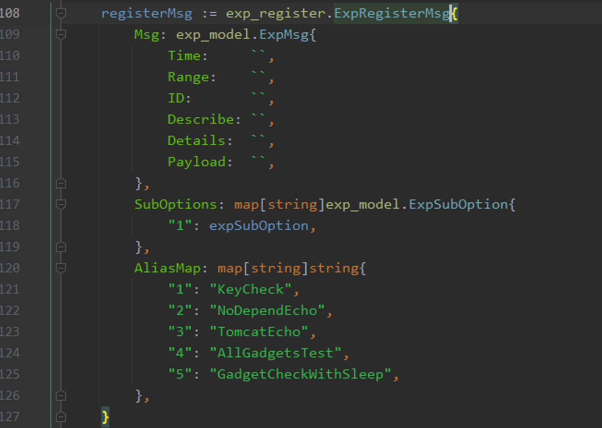
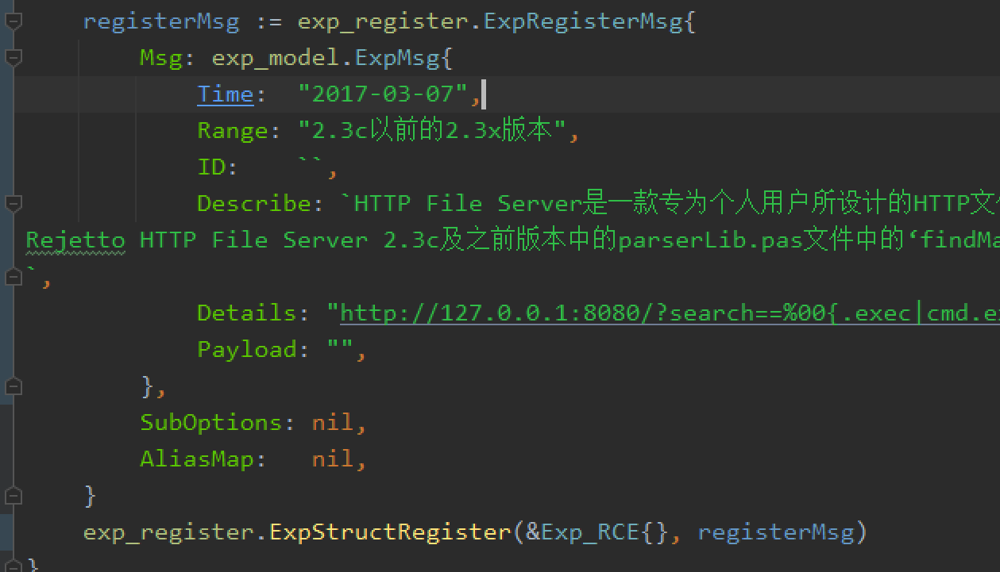
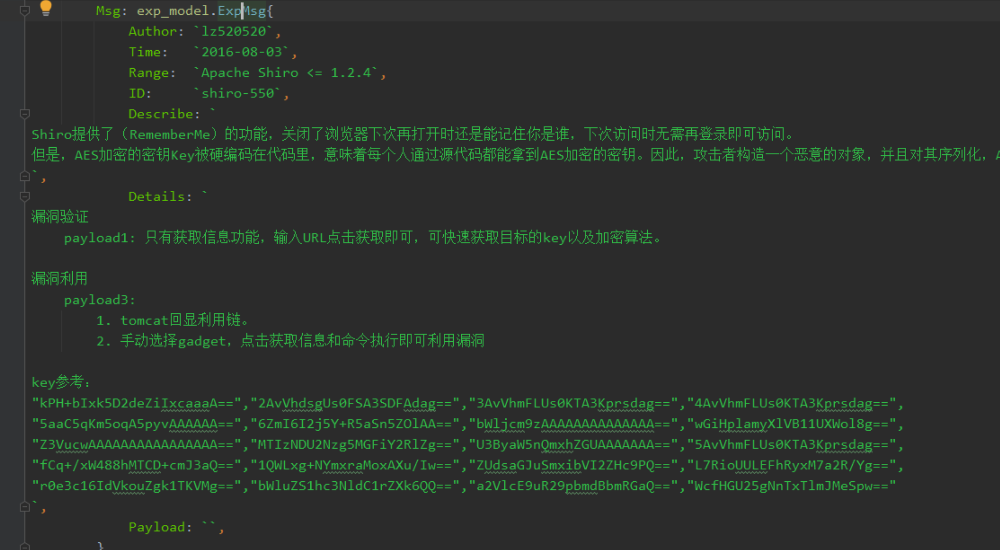
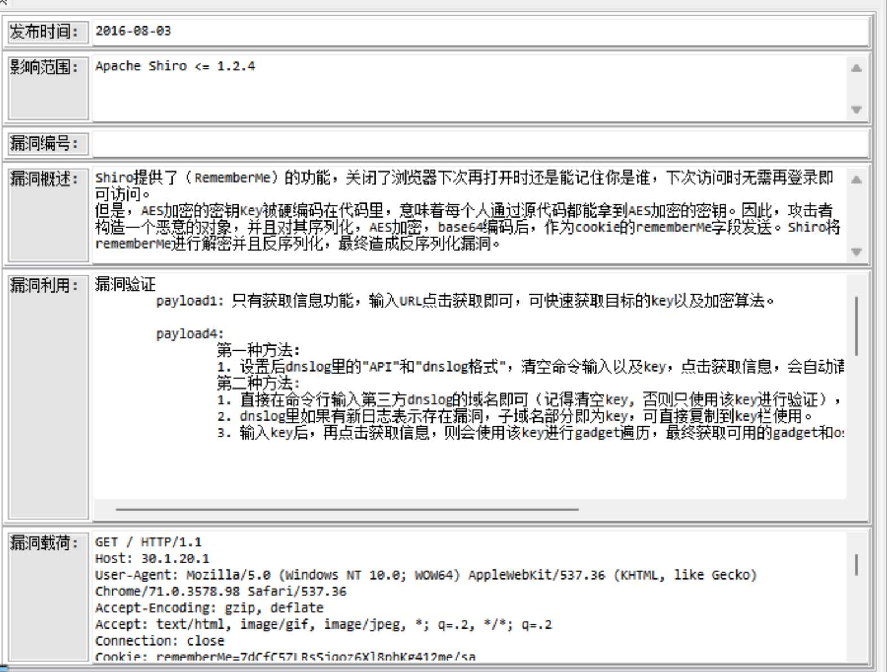
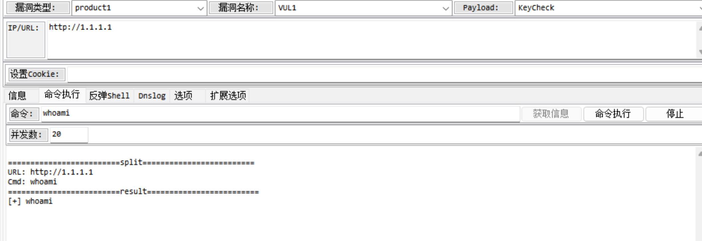
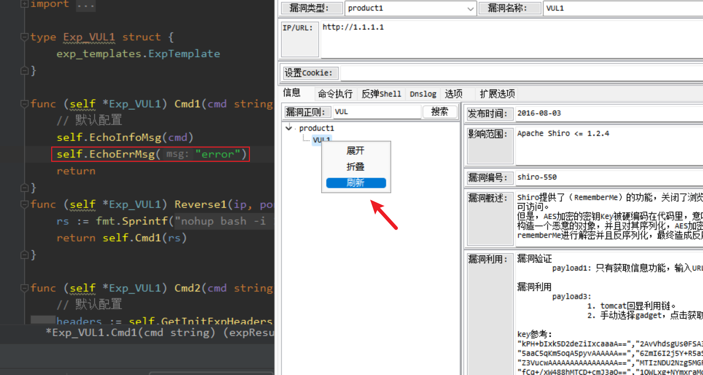
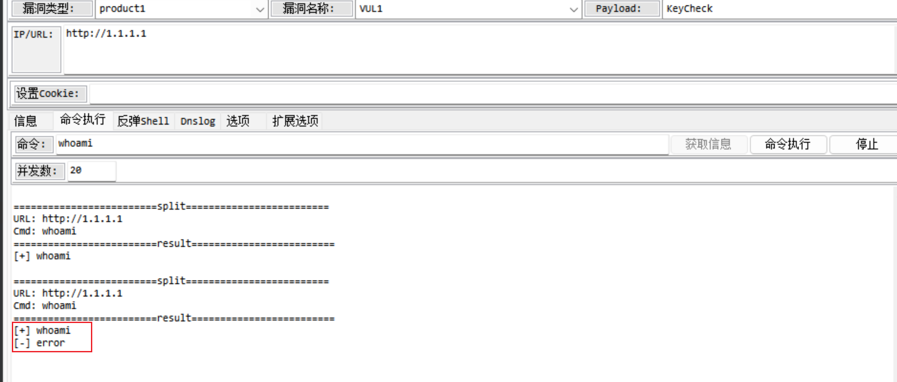

# 前言

railgun工具插件开发依赖库，由于go是编译语言，所以要实现动态代码执行，需要提前解析依赖；

我单独分离了依赖库，可用于插件编写，请提前具备go语言的基础。

目前仅支持exp的编写，后续可能会增加poc等。


# 编写规范

## 创建exp文件

根目录为`modules/exps/exp_plugins`，往下每个产品单独目录，目录名以`exp_`开头，每个目录下存在每个产品对应的各种漏洞exp的go文件，文件也是以`exp_`开头




## exp编写

### 导入依赖库

```go
import (
	"github.com/lz520520/railgunlib/modules/exps/exp_templates"
	"github.com/lz520520/railgunlib/pkg/register/exp_register"
	"github.com/lz520520/railgunlib/pkg/templates/exp_model"
)
```


### exp结构体

声明一个exp结构体，结构体名严格按照`Exp_`开头，一定要首字母大写，结构体内只需要继承`exp_templates.ExpTemplate`即可


接着就是exp的利用方法，因为一个漏洞可能有多种利用方式，并且可能会有多种不同payload，所以会如上图形成各种利用方法。

这里类型分为GetMsg/Cmd/Reverse/Upload四种，后跟payload的序号数字，一定要严格按照这个，否则无法解析。

方法签名如下

```go
func (self *exp) GetMsg1(cmd string) (expResult templates.ExpResult)
func (self *exp) Cmd1(cmd string) (expResult templates.ExpResult)
func (self *exp) Reverse1(ip, port string) (expResult templates.ExpResult)
func (self *exp) Upload1(filename string, content string) (status bool, respPath string)
```


### 编写exp举例


如一个S2-045，代码如下

```go
func (self *Exp_VUL1) Cmd2(cmd string) (expResult exp_model.ExpResult) {
	// 获取请求头配置
	headers := self.GetInitExpHeaders()

	// 构造payload，头部插入payload
	shellPayload := `%{...}`
	shellPayload = strings.Replace(shellPayload, "lz520520", cmd, 1)
	headers.Set("Content-Type", shellPayload)

	// 发送请求
	httpresp := self.HttpGet(self.Params.Target, headers)
	if httpresp.Err != nil {
		expResult.Err = httpresp.Err
		return
	}
	expResult.Result = httpresp.Body
	return

}
```


由于结构体继承了`exp_templates.ExpTemplate`,可以使用父类的方法来处理（PS：这里只是引用了其他语言里基于对象的说法，go里没有对象）


self.Params里有你需要的各种请求参数。


### 打印结果

打印结果有两种方法，将结果如下保存到相应结构体里即可

```
expResult.Result = httpresp.Body
```


或者调用logTpl.go里的方法打印也可。

```go
// 调试信息打印，开启DEBUG方可显示
func (self *ExpTemplate) EchoDebugMsg(msg string) {}
// 信息打印
func (self *ExpTemplate) EchoInfoMsg(msg string) {}
// 不换行信息打印
func (self *ExpTemplate) EchoInfoMsgWithoutReturn(msg string) {}
// 错误信息打印
func (self *ExpTemplate) EchoErrMsg(msg string) {}
// 不换行错误信息打印
func (self *ExpTemplate) EchoErrMsgWithoutReturn(msg string) {}
```


### 漏洞信息注册

漏洞编写完后，除了具体的利用过程，还有一些漏洞信息需要注册的。

编写在init方法内即可，因为go会自动运行init方法。


调用`exp_register.ExpStructRegister`传入漏洞结构体的引用，以及注册信息即可。

注册信息分为三部分，漏洞基础信息、子选项扩展，payload别名。（后两个是可选）




简易的就是如下




#### 基础信息（必选）

```go
// exp 信息栏
type ExpMsg struct {
	Author   string // 作者信息
	Time     string // 编写时间
	Range    string // 影响范围
	ID       string // CVE等编号
	Describe string // 漏洞描述
	Details  string // 漏洞利用详细说明，每个payload都有一些操作步骤，可在此详细说明。
	Payload  string // 简易payload，用于提示用
}
```

示例



效果




#### 子选项（可选）

上面编写exp时，每个payload都有一个序号，这个可以基于每个payload来指定他所需要设置的子选项，如果key设置成`""`，则表示对所有payload都生效。


ExpSubOption说明

```go
type ExpSubOption struct {
	CmdContent    string             // cmd默认内容
	CmdSubOptions []ExpSubOptionItem // cmd子选项自绘

	UploadPath       string             // 上传路径默认值
	UploadContent    string             // 上传内容默认值
	UploadSubOptions []ExpSubOptionItem // 上传子选项自绘

	Gadgets []string // gadget选项

	UploadModes []UploadModeType // 上传类型，插件暂时不提供其他选项
}

type ExpSubOptionItem struct {
	StaticText   string      // 标签名称
	Key          string      // 提取选项值所需要的参数
	Value        interface{} // 只有两种类型，string和[]string，分别对应Edit和ComboBox
	DefaultWidth int32       // 默认选项框长度，如果为0，则根据Value长度自适应。
	Position     int         // 位置，只有0/2两个值，因为cmd选项太多，如果需要第二行，则该值设置成2，
}
```

举例

```go
cmdSubOptions := []exp_model.ExpSubOptionItem{
		{
			StaticText:   "前缀: ",
			Key:          "Prefix",
			Value:        "",
			DefaultWidth: 1,
		},
		{
			StaticText: "请求方法: ",
			Key:        "Method",
			Value: []string{
				"GET",
				"POST",
			},
		},
		{
			StaticText: "加密算法: ",
			Key:        "algorithm",
			Value: []string{
				"CBC",
				"GCM",
			},
		},
		{
			StaticText: "Key: ",
			Key:        "key",
			Value:      "kPH+bIxk5D2deZiIxcaaaA==",
		},
		{
			StaticText: "Cookie关键词: ",
			Key:        "rememberMe",
			Value:      "rememberMe",
		},
		{
			StaticText: "Key数量: ",
			Key:        "KeyNum",
			Value: []string{
				"100",
				"1000",
			},
		},
	}
```

效果


#### 别名（可选）

由于上面编写exp时，每个方法名是固定的，都是以数字编号，如果每个序号需要有别名，可使用别名

```
		AliasMap: map[string]string{
			"1": "KeyCheck",
			"2": "NoDependEcho",
			"3": "TomcatEcho",
			"4": "AllGadgetsTest",
			"5": "GadgetCheckWithSleep",
		},
```

效果


### 最终效果


执行效果




并且如果修改后可右键刷新，实现实时修改调整







## 常用函数

### HTTP方法

编写方法内部通过接收者的self变量调用即可

```go
// -----------------------HTTP请求----------------------------------
func (self *ExpTemplate) HttpGetWithoutRedirect(target string, headers lzhttp.Header) (resp lzhttp.HttpResp) {
	return
}

func (self *ExpTemplate) HttpPostWithoutRedirect(target, data string, headers lzhttp.Header) (resp lzhttp.HttpResp) {
	return
}

func (self *ExpTemplate) HttpPutWithoutRedirect(target, data string, headers lzhttp.Header) (resp lzhttp.HttpResp) {
	return
}

func (self *ExpTemplate) HttpPostMultiWithoutRedirect(target string, postMultiParts []lzhttp.PostMultiPart, headers lzhttp.Header) (resp lzhttp.HttpResp) {
	return
}
```

注意事项

`HttpPostWithoutRedirect`: 如果header不设置`Content-Type`，默认为`application/x-www-form-urlencoded`


`HttpPostMultiWithoutRedirect`: 这个对应的是`multipart/form-data`，该方法需要传入一个PostMultiPart结构体，如下

```go
	multiParts := []lzhttp.PostMultiPart{
		{
			FieldName:   "filename",
			FileName:    "favicon.png",
			ContentType: "",
			Content:     []byte(content),
		},
	}
```


### 消息打印


```
// 调试信息打印，开启DEBUG方可显示
func (self *ExpTemplate) EchoDebugMsg(msg string) {}

// 信息打印
func (self *ExpTemplate) EchoInfoMsg(msg string) {}

// 不换行信息打印
func (self *ExpTemplate) EchoInfoMsgWithoutReturn(msg string) {}

// 错误信息打印
func (self *ExpTemplate) EchoErrMsg(msg string) {}

// 不换行错误信息打印
func (self *ExpTemplate) EchoErrMsgWithoutReturn(msg string) {}
```


### 其他方法


```go
// 获取设置的http头部
func (self *ExpTemplate) GetInitExpHeaders() (headers lzhttp.Header) {
	return
}
// 安全获取map里的value
func (self *ExpTemplate) GetItemSafe(s map[string]string, key string) (ret string) {
	return
}
// 只有当前URL没有路径/目录时，会添加URI
func (self *ExpTemplate) AddUri(target, uri string) (result string) {
	return
}
// 追加URL，基于当前目录
func (self *ExpTemplate) AppendUri(target, uri string) (result string) {
	return
}
// 获取hostname，如192.168.1.1:88
func (self *ExpTemplate) GetHostname(target string) (hostname string) {
	return
}
```


### goutils


```
// 获得当前程序所在的目录
func GetCurrentProcessFileDir() string {}

// 随机生成 MD5 HASH 值
func RandomMD5Hash() string {}

// 随机生成指定长度的字符串
func RandomHexString(size int) (ret string) {}

// 生成 `UUID` V4 字符串
func UUIDv4() string {}

// 获得当前用户的主目录
func UserHomeDir() string {}

// 是否正确的IP格式
func IsValidIP(ip string) bool {}

// 检测文件是否存在
func FileExists(filename string) bool {}

// 在时间范围内执行系统命令，并且将输出返回（stdout和stderr）
func ExecCmdWithTimeout(timeout time.Duration, arg ...string) ([]byte, error) {}

```


# 注意事项

1. 编写导入的库仅支持go自带库以及当前依赖库，第三方库不支持调用。